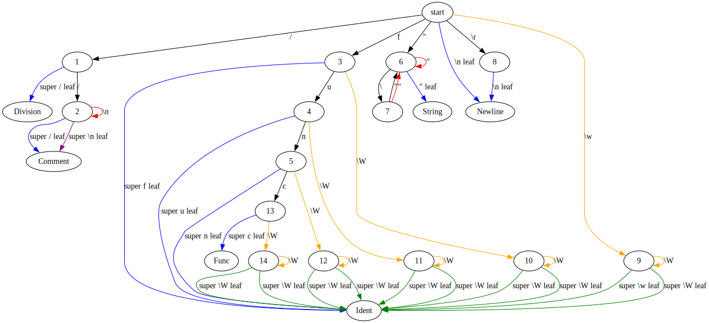

# zig lexer

> [!CAUTION]
> I don't recommend that you use this project. I have built it for myself, and
> as such there are certainly holes in the implementation that I am aware about
> but will be very difficult to reason about in the spaghetti that I have built.
>
> I have open sourced the code for the culture. If you ARE interested in
> investing some blood, sweat, and tears you are free to fork the project and
> patch the wholes that I have left. This is and will remain a project that I
> have built for myself, and as such I won't be paying attention to issues and
> PRs in this repo.

This is the home of my lexer. It uses Zig's comptime to generate jump tables at
compile time for super easy maintenance and pretty decent performance.

I primarily made this project because I want to use lexers but I am bad at
writing them and I don't really care about the implementation. I kinda just care
about the tokens and their patterns. And this is exactly that.

```zig
const lexer = @import("lexer");

const token_patterns = [_]lexer.TokenPattern{
    .Comment = .{ .pattern = "//([^\n])*", .skip = true },
    .Division = .{ .pattern = "/" },
    .Func = .{ .pattern = "func" },
    .String = .{ .pattern = "\"([^\"]|\\\\\")*\"" },
    .Newline = .{ .pattern = "(\n|\r\n)", .skip = true },
    .Ident = .{ .pattern = "\\w\\W*" },
};

const l = lexer.Lexer(&token_patterns).init(allocator);
const tokens = try l.lex(input, .{});
for (tokens) |token| {
  _ = token.token_type; // enum of all the variant names
  _ = token.source; // slice into the input
}
```

Features:

- Generates jump tables at compile time
- Supports UTF-8 out of the box
- Allows matching specific token variants into exhaustive enums
- Regular expression-esque patterns for matching
- Linear time complexity lexing
- Token variants that can be skipped and won't appear in the token enum

## Implementation details

The first step is parsing the regular expressions. This is a small pattern
language taken after regular expressions, that only has the functionality that I
find useful in making token patterns. You can see every feature that it supports
in the example above.

Once tokens are parsed into a tree that represents the structure of the pattern,
it is passed into the parser. The parser creates a jump table, which is a list
of tables. The tables are a few maps of kvs. These match a specific character to
either a next table or a leaf token. There are separate maps for direct matches,
sequence matches (something like a `\w`), and fallthroughs (if the character
doesn't match anything else and isn't a specific character).

These are the available sequences:

- **`\w`** - any alphabetic character
- **`\W`** - any alphanumeric character
- **`\0`** - any numeric character

This structure must be recursively constructed due to the fact that the regular
expression grammar returns a hierarchical structure. All that code is super
complicated and I quite frankly only have a loose grasp on what is actually
going on. But it works, and that's all I really care about.

Once the jump table has been generate, we convert it into static tables. This is
super important at the comptime -> runtime boundary. After that, once we have
UTF-8 input to lex, we just jump around the jump tables, reading through the
input.

## Visualizing the tables

Because the tables are just data in memory, we also have the ability to export
graphs representing the tables. This is available through the following API:

```zig
const writer = std.io.getStdOut().writer();
try l.to_graph(writer);
```

I found this tremendously useful in building this project. I implemented lexer
for a small example language to test out its features. Here is the graphviz of
the lexer:

[][graphviz]

## License

This project is licensed under either:

- MIT License ([LICENSE-MIT](./LICENSE-MIT))
- Apache License 2.0 ([LICENSE-APACHE](./LICENSE-APACHE))

You may choose either license.

[graphviz]: https://edotor.net/?engine=dot#digraph%20%7B%0A%20%20start%20-%3E%201%20%5Blabel%3D%22%2F%22%5D%3B%0A%20%201%20-%3E%20Division%20%5Blabel%3D%22super%20%2F%20leaf%22%20color%3Dblue%5D%3B%0A%20%20start%20-%3E%203%20%5Blabel%3D%22f%22%5D%3B%0A%20%203%20-%3E%20Ident%20%5Blabel%3D%22super%20f%20leaf%22%20color%3Dblue%5D%3B%0A%20%20start%20-%3E%206%20%5Blabel%3D%22%5C%22%22%5D%3B%0A%20%20start%20-%3E%20Newline%20%5Blabel%3D%22%5C%5Cn%20leaf%22%20color%3Dblue%5D%3B%0A%20%20start%20-%3E%208%20%5Blabel%3D%22%5C%5Cr%22%5D%3B%0A%20%20start%20-%3E%209%20%5Blabel%3D%22%5C%5Cw%22%20color%3Dorange%5D%3B%0A%20%209%20-%3E%20Ident%20%5Blabel%3D%22super%20%5C%5Cw%20leaf%22%20color%3Dgreen%5D%3B%0A%20%201%20-%3E%202%20%5Blabel%3D%22%2F%22%5D%3B%0A%20%202%20-%3E%20Comment%20%5Blabel%3D%22super%20%2F%20leaf%22%20color%3Dblue%5D%3B%0A%20%202%20-%3E%202%20%5Blabel%3D%22%5C%5Cn%22%20color%3Dred%5D%3B%0A%20%202%20-%3E%20Comment%20%5Blabel%3D%22super%20%5C%5Cn%20leaf%22%20color%3Dpurple%5D%3B%0A%20%203%20-%3E%204%20%5Blabel%3D%22u%22%5D%3B%0A%20%204%20-%3E%20Ident%20%5Blabel%3D%22super%20u%20leaf%22%20color%3Dblue%5D%3B%0A%20%203%20-%3E%2010%20%5Blabel%3D%22%5C%5CW%22%20color%3Dorange%5D%3B%0A%20%2010%20-%3E%20Ident%20%5Blabel%3D%22super%20%5C%5CW%20leaf%22%20color%3Dgreen%5D%3B%0A%20%204%20-%3E%205%20%5Blabel%3D%22n%22%5D%3B%0A%20%205%20-%3E%20Ident%20%5Blabel%3D%22super%20n%20leaf%22%20color%3Dblue%5D%3B%0A%20%204%20-%3E%2011%20%5Blabel%3D%22%5C%5CW%22%20color%3Dorange%5D%3B%0A%20%2011%20-%3E%20Ident%20%5Blabel%3D%22super%20%5C%5CW%20leaf%22%20color%3Dgreen%5D%3B%0A%20%205%20-%3E%2013%20%5Blabel%3D%22c%22%5D%3B%0A%20%2013%20-%3E%20Func%20%5Blabel%3D%22super%20c%20leaf%22%20color%3Dblue%5D%3B%0A%20%205%20-%3E%2012%20%5Blabel%3D%22%5C%5CW%22%20color%3Dorange%5D%3B%0A%20%2012%20-%3E%20Ident%20%5Blabel%3D%22super%20%5C%5CW%20leaf%22%20color%3Dgreen%5D%3B%0A%20%206%20-%3E%207%20%5Blabel%3D%22%5C%5C%22%5D%3B%0A%20%206%20-%3E%20%22String%22%20%5Blabel%3D%22%5C%22%20leaf%22%20color%3Dblue%5D%3B%0A%20%206%20-%3E%206%20%5Blabel%3D%22%5C%22%22%20color%3Dred%5D%3B%0A%20%207%20-%3E%206%20%5Blabel%3D%22%5C%22%22%5D%3B%0A%20%207%20-%3E%206%20%5Blabel%3D%22%5C%22%22%20color%3Dred%5D%3B%0A%20%208%20-%3E%20Newline%20%5Blabel%3D%22%5C%5Cn%20leaf%22%20color%3Dblue%5D%3B%0A%20%209%20-%3E%209%20%5Blabel%3D%22%5C%5CW%22%20color%3Dorange%5D%3B%0A%20%209%20-%3E%20Ident%20%5Blabel%3D%22super%20%5C%5CW%20leaf%22%20color%3Dgreen%5D%3B%0A%20%2010%20-%3E%2010%20%5Blabel%3D%22%5C%5CW%22%20color%3Dorange%5D%3B%0A%20%2010%20-%3E%20Ident%20%5Blabel%3D%22super%20%5C%5CW%20leaf%22%20color%3Dgreen%5D%3B%0A%20%2011%20-%3E%2011%20%5Blabel%3D%22%5C%5CW%22%20color%3Dorange%5D%3B%0A%20%2011%20-%3E%20Ident%20%5Blabel%3D%22super%20%5C%5CW%20leaf%22%20color%3Dgreen%5D%3B%0A%20%2012%20-%3E%2012%20%5Blabel%3D%22%5C%5CW%22%20color%3Dorange%5D%3B%0A%20%2012%20-%3E%20Ident%20%5Blabel%3D%22super%20%5C%5CW%20leaf%22%20color%3Dgreen%5D%3B%0A%20%2013%20-%3E%2014%20%5Blabel%3D%22%5C%5CW%22%20color%3Dorange%5D%3B%0A%20%2014%20-%3E%20Ident%20%5Blabel%3D%22super%20%5C%5CW%20leaf%22%20color%3Dgreen%5D%3B%0A%20%2014%20-%3E%2014%20%5Blabel%3D%22%5C%5CW%22%20color%3Dorange%5D%3B%0A%20%2014%20-%3E%20Ident%20%5Blabel%3D%22super%20%5C%5CW%20leaf%22%20color%3Dgreen%5D%3B%0A%7D%0A
